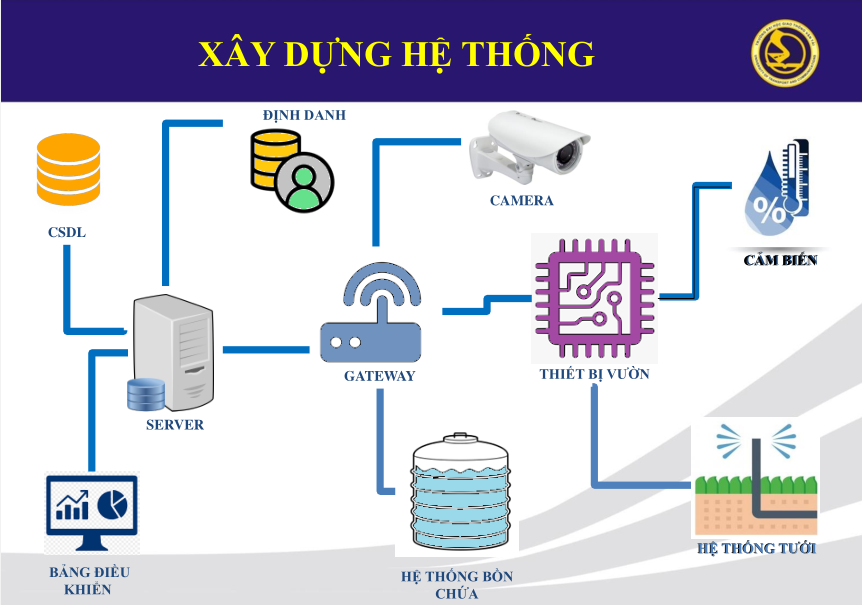

# Platform IoTs

## Kiến trúc dự án

## Video Demo

## Desktop Application (ElectronJS)
Kéo [source](https://github.com/spiderock98/PairDevice-ElectronApp) về tự build nha :)

## Website Demo
Truy cập bằng browser sẽ không có đầy đủ tính năng [spiderock.xyz](http://spiderock.xyz/)

## Báo Cáo
* [Báo Cáo .docx](docs/word.docx)
* [Thuyết trình .pptx](docs/slide.pptx)

## Tác Giả
* Nguyễn Minh Tiến - [Facebook](https://www.facebook.com/spiderock98) | [Github](https://github.com/spiderock98)
* Phạm Chí Tâm - [Facebook](https://www.facebook.com/profile.php?id=100007889464843)
* Ngô Quốc Cường - [Facebook](https://www.facebook.com/Henry2901)
